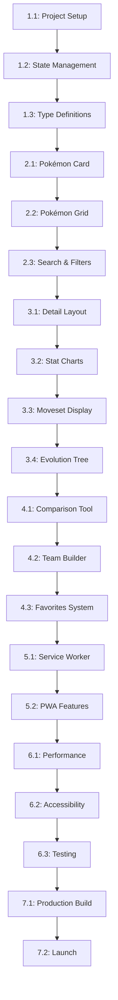

# Implementation Tasks: Pokémon Database Application

**Feature**: 001-pokemon-database  
**Created**: 2024-12-19  
**Status**: Draft

## Task Overview

This document breaks down the Pokémon Database application implementation into actionable, sequential tasks. Each task includes acceptance criteria and estimated complexity.

---

## Phase 1: Project Setup & Foundation

### Task 1.1: Initialize Project Structure
**Priority**: High  
**Estimated Time**: 2 hours  
**Dependencies**: None

**Description**: Set up the React + TypeScript project with Vite and configure the development environment.

**Acceptance Criteria**:
- [ ] Create new Vite React + TypeScript project
- [ ] Configure ESLint with TypeScript rules
- [ ] Set up Prettier for code formatting
- [ ] Install and configure Tailwind CSS
- [ ] Set up project folder structure
- [ ] Create basic routing setup
- [ ] Verify development server runs successfully

**Implementation Steps**:
1. Run `npm create vite@latest pokemon-database -- --template react-ts`
2. Install dependencies: `npm install`
3. Configure Tailwind CSS
4. Set up ESLint and Prettier
5. Create folder structure as per architecture plan
6. Set up basic routing with React Router

### Task 1.2: Configure State Management & Data Fetching
**Priority**: High  
**Estimated Time**: 1.5 hours  
**Dependencies**: Task 1.1

**Description**: Set up Zustand for state management and TanStack Query for API data fetching.

**Acceptance Criteria**:
- [ ] Install Zustand and TanStack Query
- [ ] Create basic store structure for Pokémon data
- [ ] Set up API client for PokéAPI
- [ ] Configure query client with caching
- [ ] Create basic data fetching hooks
- [ ] Test API connection to PokéAPI

**Implementation Steps**:
1. Install required packages: `npm install zustand @tanstack/react-query`
2. Create stores directory and basic store files
3. Set up API client with base configuration
4. Configure React Query provider
5. Create custom hooks for data fetching

### Task 1.3: Create Type Definitions
**Priority**: High  
**Estimated Time**: 2 hours  
**Dependencies**: Task 1.2

**Description**: Define TypeScript interfaces for all Pokémon-related data structures.

**Acceptance Criteria**:
- [ ] Create comprehensive type definitions for Pokémon data
- [ ] Define interfaces for stats, types, abilities, moves
- [ ] Create types for evolution chains and species data
- [ ] Define API response types
- [ ] Create utility types for filtering and search
- [ ] Ensure type safety across the application

**Implementation Steps**:
1. Analyze PokéAPI response structure
2. Create type definitions in `src/types/` directory
3. Define interfaces for all data models
4. Create utility types for common operations
5. Export all types from index file

---

## Phase 2: Core Pokémon Components

### Task 2.1: Build Pokémon Card Component
**Priority**: High  
**Estimated Time**: 3 hours  
**Dependencies**: Task 1.3

**Description**: Create a reusable Pokémon card component for the grid view.

**Acceptance Criteria**:
- [ ] Display Pokémon sprite, name, ID, and types
- [ ] Show type-colored chips with proper styling
- [ ] Implement hover effects and animations
- [ ] Make component responsive for different screen sizes
- [ ] Add loading skeleton state
- [ ] Ensure accessibility compliance

**Implementation Steps**:
1. Create `PokemonCard` component in `src/components/pokemon/`
2. Design card layout with Tailwind CSS
3. Implement type coloring system
4. Add hover and focus states
5. Create loading skeleton component
6. Add proper ARIA labels and keyboard navigation

### Task 2.2: Create Pokémon Grid with Virtualization
**Priority**: High  
**Estimated Time**: 4 hours  
**Dependencies**: Task 2.1

**Description**: Build a performant grid component that can handle large datasets.

**Acceptance Criteria**:
- [ ] Display Pokémon in a responsive grid layout
- [ ] Implement virtual scrolling for performance
- [ ] Support infinite scroll or pagination
- [ ] Handle loading states gracefully
- [ ] Implement lazy loading for images
- [ ] Add smooth scrolling and animations

**Implementation Steps**:
1. Install react-window for virtualization
2. Create `PokemonGrid` component
3. Implement virtual scrolling logic
4. Add infinite scroll functionality
5. Implement image lazy loading
6. Add loading and error states

### Task 2.3: Implement Search and Filter System
**Priority**: High  
**Estimated Time**: 4 hours  
**Dependencies**: Task 2.2

**Description**: Create comprehensive search and filtering capabilities.

**Acceptance Criteria**:
- [ ] Implement real-time search with debouncing
- [ ] Create filter panels for type, generation, stats
- [ ] Support multiple filter combinations
- [ ] Add clear filters functionality
- [ ] Implement search highlighting
- [ ] Show active filter count

**Implementation Steps**:
1. Create search input component with debouncing
2. Build filter components for each category
3. Implement filter state management
4. Create filter combination logic
5. Add visual feedback for active filters
6. Implement search result highlighting

---

## Phase 3: Pokémon Detail View

### Task 3.1: Create Pokémon Detail Layout
**Priority**: High  
**Estimated Time**: 3 hours  
**Dependencies**: Task 2.3

**Description**: Build the main detail view layout with tabbed interface.

**Acceptance Criteria**:
- [ ] Create tabbed interface (Stats, Moves, Evolution, Info)
- [ ] Display large Pokémon artwork with type-themed background
- [ ] Implement responsive layout for mobile and desktop
- [ ] Add navigation between Pokémon
- [ ] Include breadcrumb navigation
- [ ] Add share functionality

**Implementation Steps**:
1. Create `PokemonDetail` component with tab structure
2. Design responsive layout with Tailwind CSS
3. Implement tab switching logic
4. Add navigation between Pokémon
5. Create breadcrumb component
6. Add social sharing functionality

### Task 3.2: Build Stat Visualization Components
**Priority**: High  
**Estimated Time**: 4 hours  
**Dependencies**: Task 3.1

**Description**: Create interactive charts for Pokémon stats and type effectiveness.

**Acceptance Criteria**:
- [ ] Implement radar chart for base stats
- [ ] Create bar chart for stat comparison
- [ ] Build type effectiveness matrix
- [ ] Add interactive tooltips and labels
- [ ] Support different chart themes
- [ ] Ensure mobile responsiveness

**Implementation Steps**:
1. Install Chart.js and react-chartjs-2
2. Create `StatRadarChart` component
3. Build `StatBarChart` component
4. Implement type effectiveness matrix
5. Add chart theming and responsiveness
6. Create chart utility functions

### Task 3.3: Implement Moveset Display
**Priority**: Medium  
**Estimated Time**: 3 hours  
**Dependencies**: Task 3.2

**Description**: Create organized display of Pokémon moves by learning method.

**Acceptance Criteria**:
- [ ] Display moves organized by category (level-up, TM, egg, tutor)
- [ ] Show move details (power, accuracy, type, PP)
- [ ] Implement move filtering and sorting
- [ ] Add move type effectiveness indicators
- [ ] Include move descriptions and effects
- [ ] Support search within moves

**Implementation Steps**:
1. Create `MovesetDisplay` component
2. Organize moves by learning method
3. Add move detail tooltips
4. Implement move filtering
5. Create move type indicators
6. Add move search functionality

### Task 3.4: Build Evolution Tree Component
**Priority**: Medium  
**Estimated Time**: 4 hours  
**Dependencies**: Task 3.3

**Description**: Create visual evolution tree with navigation between related Pokémon.

**Acceptance Criteria**:
- [ ] Display evolution chain as a tree structure
- [ ] Show evolution conditions and requirements
- [ ] Implement clickable navigation to related Pokémon
- [ ] Support different evolution types (level, item, trade)
- [ ] Add evolution method icons
- [ ] Ensure mobile-friendly layout

**Implementation Steps**:
1. Create `EvolutionTree` component
2. Parse evolution chain data
3. Build tree visualization logic
4. Add evolution condition display
5. Implement navigation between Pokémon
6. Create mobile-responsive layout

---

## Phase 4: Advanced Features

### Task 4.1: Create Comparison Tool
**Priority**: Medium  
**Estimated Time**: 4 hours  
**Dependencies**: Task 3.4

**Description**: Build side-by-side comparison functionality for Pokémon.

**Acceptance Criteria**:
- [ ] Allow selection of up to 2 Pokémon for comparison
- [ ] Display side-by-side stat comparison
- [ ] Show type effectiveness comparison
- [ ] Compare abilities and moves
- [ ] Add visual indicators for differences
- [ ] Support mobile comparison view

**Implementation Steps**:
1. Create `ComparisonTool` component
2. Implement Pokémon selection logic
3. Build side-by-side layout
4. Create comparison charts
5. Add difference highlighting
6. Implement mobile comparison mode

### Task 4.2: Build Team Builder
**Priority**: Medium  
**Estimated Time**: 5 hours  
**Dependencies**: Task 4.1

**Description**: Create team composition tool with drag-and-drop functionality.

**Acceptance Criteria**:
- [ ] Allow adding/removing Pokémon to team (max 6)
- [ ] Implement drag-and-drop team building
- [ ] Show team type coverage analysis
- [ ] Display team stat totals
- [ ] Add team validation and suggestions
- [ ] Support team sharing via URL

**Implementation Steps**:
1. Install react-beautiful-dnd for drag-and-drop
2. Create `TeamBuilder` component
3. Implement team state management
4. Build drag-and-drop interface
5. Add team analysis features
6. Create team sharing functionality

### Task 4.3: Implement Favorites System
**Priority**: Low  
**Estimated Time**: 2 hours  
**Dependencies**: Task 4.2

**Description**: Add ability to save favorite Pokémon and teams.

**Acceptance Criteria**:
- [ ] Allow users to favorite/unfavorite Pokémon
- [ ] Save favorites to localStorage
- [ ] Display favorites in dedicated view
- [ ] Support bulk operations on favorites
- [ ] Add favorites counter
- [ ] Implement favorites filtering

**Implementation Steps**:
1. Create favorites store with Zustand
2. Add favorite/unfavorite functionality
3. Create favorites view component
4. Implement localStorage persistence
5. Add bulk operations
6. Create favorites filtering

---

## Phase 5: Offline Support & PWA

### Task 5.1: Implement Service Worker
**Priority**: Medium  
**Estimated Time**: 3 hours  
**Dependencies**: Task 4.3

**Description**: Add offline support with service worker for caching.

**Acceptance Criteria**:
- [ ] Cache API responses for offline use
- [ ] Cache static assets
- [ ] Show offline indicator
- [ ] Handle offline/online state changes
- [ ] Implement cache management
- [ ] Add offline fallback pages

**Implementation Steps**:
1. Create service worker file
2. Implement API response caching
3. Add static asset caching
4. Create offline indicator component
5. Implement cache management
6. Add offline fallback UI

### Task 5.2: Add PWA Features
**Priority**: Low  
**Estimated Time**: 2 hours  
**Dependencies**: Task 5.1

**Description**: Convert application to Progressive Web App.

**Acceptance Criteria**:
- [ ] Create PWA manifest file
- [ ] Add app icons for different sizes
- [ ] Implement install prompt
- [ ] Add splash screen
- [ ] Support app-like navigation
- [ ] Test on mobile devices

**Implementation Steps**:
1. Create PWA manifest
2. Generate app icons
3. Implement install prompt
4. Add splash screen
5. Configure PWA settings
6. Test installation process

---

## Phase 6: Polish & Optimization

### Task 6.1: Performance Optimization
**Priority**: High  
**Estimated Time**: 3 hours  
**Dependencies**: Task 5.2

**Description**: Optimize application performance and bundle size.

**Acceptance Criteria**:
- [ ] Implement code splitting
- [ ] Optimize image loading
- [ ] Minimize bundle size
- [ ] Add performance monitoring
- [ ] Optimize API calls
- [ ] Implement lazy loading

**Implementation Steps**:
1. Analyze bundle size and performance
2. Implement route-based code splitting
3. Optimize image loading and compression
4. Add performance monitoring
5. Optimize API call patterns
6. Implement comprehensive lazy loading

### Task 6.2: Accessibility Improvements
**Priority**: High  
**Estimated Time**: 2 hours  
**Dependencies**: Task 6.1

**Description**: Ensure full accessibility compliance.

**Acceptance Criteria**:
- [ ] Add proper ARIA labels
- [ ] Implement keyboard navigation
- [ ] Ensure screen reader compatibility
- [ ] Add focus indicators
- [ ] Test with accessibility tools
- [ ] Support high contrast mode

**Implementation Steps**:
1. Audit accessibility with tools
2. Add missing ARIA labels
3. Implement keyboard navigation
4. Test with screen readers
5. Add focus management
6. Test high contrast mode

### Task 6.3: Testing Implementation
**Priority**: Medium  
**Estimated Time**: 4 hours  
**Dependencies**: Task 6.2

**Description**: Add comprehensive testing coverage.

**Acceptance Criteria**:
- [ ] Unit tests for utility functions
- [ ] Component tests for key components
- [ ] Integration tests for data flow
- [ ] E2E tests for critical user flows
- [ ] Test coverage > 80%
- [ ] Automated test running

**Implementation Steps**:
1. Set up testing framework
2. Write unit tests for utilities
3. Create component tests
4. Add integration tests
5. Implement E2E tests
6. Set up test coverage reporting

---

## Phase 7: Deployment & Launch

### Task 7.1: Production Build Setup
**Priority**: High  
**Estimated Time**: 2 hours  
**Dependencies**: Task 6.3

**Description**: Configure production build and deployment.

**Acceptance Criteria**:
- [ ] Optimize production build
- [ ] Configure environment variables
- [ ] Set up build pipeline
- [ ] Test production build locally
- [ ] Configure static hosting
- [ ] Set up CI/CD pipeline

**Implementation Steps**:
1. Configure production build settings
2. Set up environment variables
3. Create build scripts
4. Test production build
5. Configure hosting platform
6. Set up automated deployment

### Task 7.2: Final Testing & Launch
**Priority**: High  
**Estimated Time**: 3 hours  
**Dependencies**: Task 7.1

**Description**: Conduct final testing and launch the application.

**Acceptance Criteria**:
- [ ] Test all features in production
- [ ] Verify performance metrics
- [ ] Test on multiple devices
- [ ] Validate accessibility
- [ ] Check offline functionality
- [ ] Launch and monitor

**Implementation Steps**:
1. Conduct comprehensive testing
2. Verify performance benchmarks
3. Test on various devices
4. Validate accessibility compliance
5. Test offline functionality
6. Deploy and monitor launch

---

## Task Dependencies

## Estimated Timeline

- **Phase 1**: 5.5 hours
- **Phase 2**: 11 hours  
- **Phase 3**: 14 hours
- **Phase 4**: 11 hours
- **Phase 5**: 5 hours
- **Phase 6**: 9 hours
- **Phase 7**: 5 hours

**Total Estimated Time**: 60.5 hours

## Risk Mitigation

### High-Risk Tasks
- **Task 2.2**: Virtual scrolling complexity
- **Task 3.2**: Chart library integration
- **Task 4.2**: Drag-and-drop functionality
- **Task 5.1**: Service worker implementation

### Mitigation Strategies
- Start with simpler implementations and iterate
- Use well-documented libraries with good community support
- Implement fallbacks for complex features
- Test early and often on target devices
